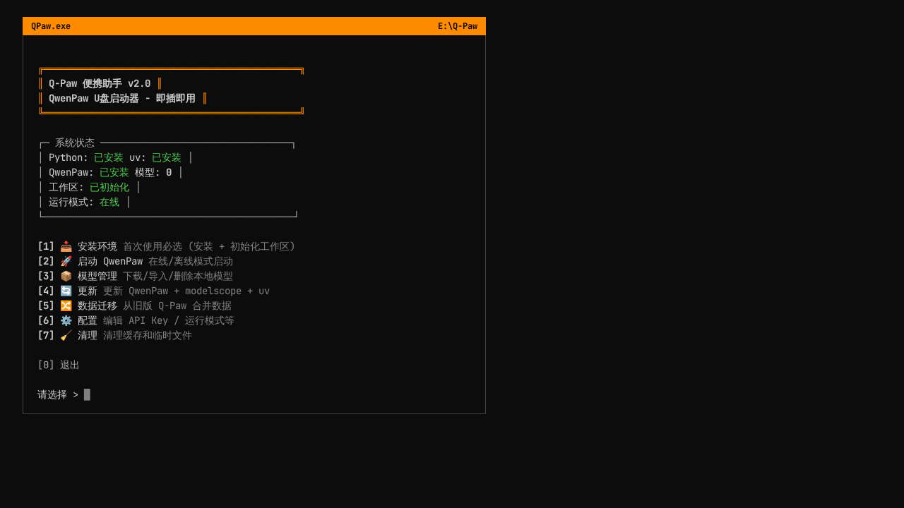
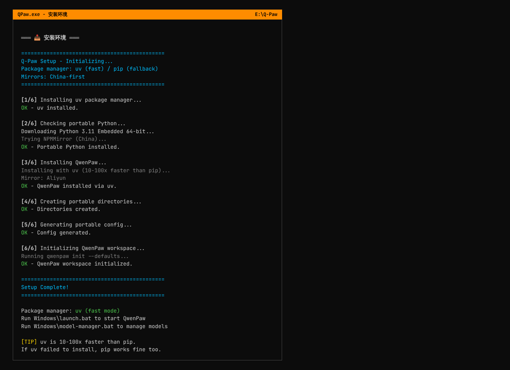
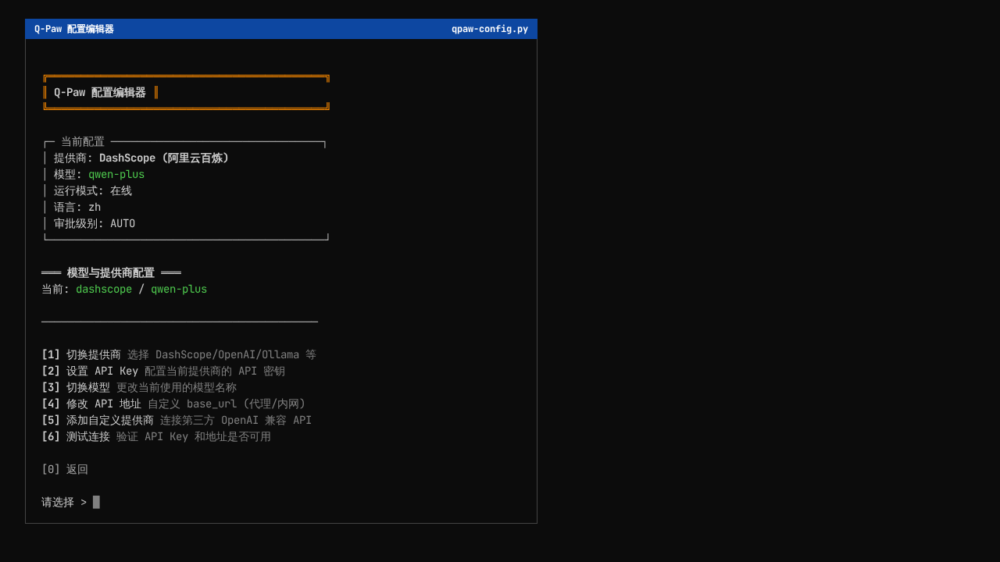
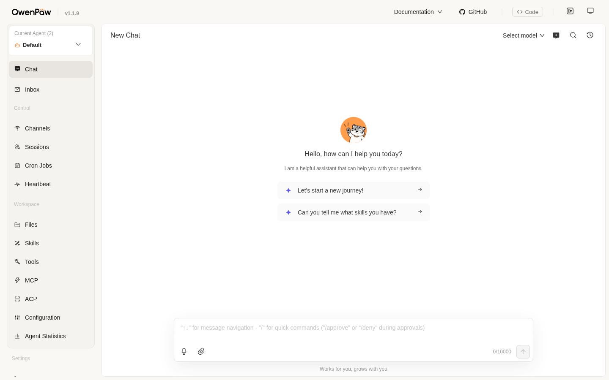

<div align="center">

# 🐾 Q-Paw 便携版

### QwenPaw U盘启动器 — 即插即用，随拔即走

[](https://github.com/MistyRainStudio/Q-Paw)
[](https://github.com/agentscope-ai/QwenPaw)
[](LICENSE)

**把千问个人智能体工作台装进U盘，走到哪里，AI 就跟到哪里。**

[English](README.md) | 中文

</div>

## 📸 截图预览

<table>
  <tr>
    <td align="center"><b>QPaw.exe 主菜单</b></td>
    <td align="center"><b>安装过程</b></td>
  </tr>
  <tr>
    <td></td>
    <td></td>
  </tr>
  <tr>
    <td align="center"><b>配置编辑器</b></td>
    <td align="center"><b>QwenPaw WebUI</b></td>
  </tr>
  <tr>
    <td></td>
    <td></td>
  </tr>
</table>

---

## ✨ Q-Paw 是什么？

**Q-Paw** 参照 [U-Claw（虾盘）](https://github.com/dongsheng123132/u-claw) 的便携U盘思路，将 [QwenPaw（千问个人智能体工作台）](https://github.com/agentscope-ai/QwenPaw) 打包成U盘便携版。名字取自 **Q**wen + **Paw**（爪子），寓意千问的智识与爪子的温度——一只随身携带的"数字小爪"🐾。

QwenPaw 是由 AgentScope 团队开源的 AI 智能体框架，支持工具调用、文件操作、代码执行、多轮对话等丰富能力。Q-Paw 让它变得真正便携——所有程序、配置、数据和模型都保存在U盘上，拔出U盘后宿主电脑不留任何痕迹。

### 核心亮点

| 特点 | 说明 |
|------|------|
| 🖥️ **一键菜单** | `QPaw.exe` 仅 755KB，可视化菜单涵盖安装、启动、配置、模型管理等全部操作 |
| 🔌 **即插即用** | 插入U盘，双击 `QPaw.exe` 即可使用，无需安装到宿主机 |
| 🚀 **随拔即走** | 所有数据保存在U盘，拔出不留痕迹（包括 Python 缓存、pip/uv 缓存、模型缓存等） |
| ⚡ **极速安装** | 默认使用 uv（比 pip 快 10-100 倍），不可用时自动回退到 pip |
| 🌐 **免翻墙** | 依赖从阿里云/清华/华为镜像源下载，国内网络环境友好 |
| 📦 **模型按需** | 默认在线模式不下载模型，可按需从 ModelScope 下载或导入本地模型 |
| ⚙️ **交互配置** | 内置 Python 配置编辑器，可直接修改 JSON 配置文件（提供商、模型、API Key 等） |
| 🛡️ **安全防护** | 继承 QwenPaw 三层安全体系（工具守卫 / 文件防护 / 技能扫描） |
| 💻 **跨平台** | Windows（一键菜单 + 脚本）、macOS / Linux（Shell 脚本） |

---

## 🚀 快速开始

### Windows（推荐）

```
1. 将整个 Q-Paw 文件夹复制到U盘根目录
2. 双击 QPaw.exe
3. 选择 [1] 安装环境
4. 选择 [2] 启动 QwenPaw
```

### macOS / Linux

```bash
cd macOS_Linux
chmod +x setup.sh && ./setup.sh     # 安装环境
./launch.sh                          # 启动 QwenPaw
```

### 使用脚本（Windows）

如果不想用 `QPaw.exe`，也可以直接双击 `Windows/` 目录下的脚本：

| 脚本 | 功能 |
|------|------|
| `setup.bat` | 安装环境（首次使用必选） |
| `launch.bat` | 启动 QwenPaw |
| `configure.bat` | 交互式配置编辑器 |
| `model-manager.bat` | 模型管理（下载/导入/删除） |
| `update.bat` | 更新 QwenPaw + modelscope + uv |
| `migrate.bat` | 从旧版 Q-Paw 迁移数据 |
| `cleanup.bat` | 清理缓存和临时文件 |

---

## 📦 安装过程详解

运行安装（`QPaw.exe → [1]` 或 `setup.bat` / `setup.sh`）时，脚本会自动执行以下 6 个步骤：


### 步骤 1：安装 uv 包管理器

uv 是由 Astral（Ruff 团队）开发的极速 Python 包管理器，安装速度比 pip 快 10-100 倍。脚本会优先从 NPMMirror（国内镜像）下载，失败则回退到 GitHub。下载后放置到 `bin/uv.exe`（Windows）或 `bin/uv`（macOS/Linux）。

如果 uv 下载失败，脚本会自动回退到 pip，不影响后续安装。

### 步骤 2：下载便携 Python

根据操作系统下载不同的 Python 环境：

- **Windows**：Python 3.11 Embedded（约 15MB），从 NPMMirror / 华为云 / python.org 三级镜像下载。下载后自动配置 pip 支持（修改 `python311._pth` 并安装 pip）。
- **macOS**：Miniconda（Apple Silicon / Intel 自动适配），从清华 TUNA 镜像下载。
- **Linux**：Miniconda（x86_64），同样从清华 TUNA 镜像下载。

所有 Python 环境安装到U盘上的 `python/`、`python-macos/` 或 `python-linux/` 目录，不会影响宿主机的 Python。

### 步骤 3：安装 QwenPaw

使用 uv（优先）或 pip（兜底）安装 `qwenpaw` 及其依赖。安装过程会依次尝试四个镜像源：

1. 阿里云 PyPI 镜像
2. 清华 TUNA PyPI 镜像
3. 华为云 PyPI 镜像
4. PyPI 官方源

确保在国内网络环境下也能顺利完成安装。如果 QwenPaw 已经安装过，此步骤会自动跳过。

### 步骤 4：创建便携目录结构

在U盘上创建以下目录：

```
data/          → QwenPaw 工作目录（配置、对话历史、技能等）
config/        → 便携模式配置文件
models/        → 本地模型存放目录
logs/          → 运行日志
scripts/       → 辅助脚本（如配置编辑器）
bin/           → uv 二进制文件
```

### 步骤 5：生成便携模式配置

自动生成 `config/portable.env`，包含便携模式标志、路径配置、包管理器类型、模型运行模式（默认在线）和 pip 镜像地址等。如果文件已存在则跳过，避免覆盖用户自定义配置。

### 步骤 6：初始化 QwenPaw 工作区

QwenPaw 首次运行前必须执行 `qwenpaw init`，它会生成核心配置文件和工作目录结构。Q-Paw 自动处理此步骤，将工作区指向U盘的 `data/` 目录。具体生成的文件包括：

- `data/config.json` — 主配置文件（Agent 设置、安全配置、渠道配置等）
- `data/HEARTBEAT.md` — QwenPaw 工作区心跳文件
- `data/.secret/` — 敏感数据目录（API Key 加密存储等）
- `data/.backups/` — 配置备份目录

同时，所有可能写入宿主机的缓存目录都被重定向到U盘：

| 环境变量 | 指向位置 | 用途 |
|----------|---------|------|
| `PIP_CACHE_DIR` | `cache/pip/` | pip 包缓存 |
| `UV_CACHE_DIR` | `cache/uv/` | uv 包缓存 |
| `MODELSCOPE_CACHE` | `cache/modelscope/` | ModelScope 模型缓存 |
| `HUGGINGFACE_HUB_CACHE` | `cache/huggingface/` | HuggingFace 模型缓存 |

> 如果初始化失败，脚本会提示手动运行方式。安装中断后直接重新运行即可，已完成的步骤会自动跳过。

---

## 📁 目录结构

```
Q-Paw/                          ← U盘根目录
├── QPaw.exe                    # 一键菜单（755KB，Go 编写，独立运行）
│
├── Windows/                    # Windows 脚本
│   ├── setup.bat               #   初始化安装（6步自动完成）
│   ├── launch.bat              #   启动 QwenPaw（自动检测环境）
│   ├── configure.bat           #   交互式配置编辑器入口
│   ├── model-manager.bat       #   模型管理（下载/导入/删除/切换模式）
│   ├── update.bat              #   更新（uv + QwenPaw + modelscope）
│   ├── migrate.bat             #   数据迁移（从旧版合并）
│   └── cleanup.bat             #   清理缓存和临时文件
│
├── macOS_Linux/                # macOS / Linux 脚本
│   ├── setup.sh                #   初始化安装
│   ├── launch.sh               #   启动 QwenPaw
│   ├── configure.sh            #   交互式配置编辑器入口
│   ├── model-manager.sh        #   模型管理
│   ├── update.sh               #   更新
│   ├── migrate.sh              #   数据迁移
│   └── cleanup.sh              #   清理缓存
│
├── bin/                        # 二进制工具
│   ├── uv.exe / uv             #   uv 包管理器（45MB，比 pip 快 10-100x）
│   └── uvx.exe / uvx           #   uv 工具运行器
│
├── scripts/                    # 辅助脚本
│   └── qpaw-config.py          #   交互式配置编辑器（Python）
│
├── installer/                  # QPaw.exe 源码
│   ├── main.go                 #   Go 源码
│   └── go.mod                  #   Go 模块定义
│
├── config/                     # 配置文件
│   ├── portable.env            #   便携模式环境变量（setup 自动生成）
│   ├── portable.env.example    #   便携模式配置示例
│   ├── qwenpaw-config.example.yaml  # QwenPaw 配置示例
│   └── custom-models.example.yaml   # 自定义模型配置示例
│
├── python/                     # Windows 便携 Python (Embedded)
├── python-macos/               # macOS 便携 Python (Miniconda)
├── python-linux/               # Linux 便携 Python (Miniconda)
│
├── models/                     # 本地模型目录（按需下载，默认为空）
├── data/                       # QwenPaw 工作目录（QWENPAW_WORKING_DIR）
│   ├── config.json             #   主配置文件
│   ├── HEARTBEAT.md            #   工作区心跳
│   ├── .secret/                #   敏感数据（API Key 加密存储）
│   │   └── providers/          #     LLM 提供商配置
│   │       ├── active_model.json     活跃模型选择
│   │       ├── builtin/              内置提供商配置
│   │       └── custom/               自定义提供商配置
│   └── .backups/               #   配置备份
├── cache/                      # 缓存目录（重定向到U盘）
│   ├── pip/                    #   pip 缓存
│   ├── uv/                     #   uv 缓存
│   ├── modelscope/             #   ModelScope 缓存
│   └── huggingface/            #   HuggingFace 缓存
├── logs/                       # 日志文件
├── README.md                   # 英文文档
└── README_zh.md                # 中文文档（本文件）
```

---

## 🖥️ QPaw.exe 一键菜单

`QPaw.exe` 是用 Go 编写的轻量级菜单程序（仅 755KB），提供 7 大功能：


启动时会自动检测 Python、uv、QwenPaw 的安装状态和工作区初始化状态，帮助用户了解当前环境情况。

菜单提供以下选项：

| 选项 | 功能 | 说明 |
|------|------|------|
| `[1]` | 📥 安装环境 | 首次使用必选 (安装 + 初始化工作区) |
| `[2]` | 🚀 启动 QwenPaw | 在线/离线模式启动 |
| `[3]` | 📦 模型管理 | 下载/导入/删除本地模型 |
| `[4]` | 🔄 更新 | 更新 QwenPaw + modelscope + uv |
| `[5]` | 🔀 数据迁移 | 从旧版 Q-Paw 合并数据 |
| `[6]` | ⚙️ 配置 | 编辑 API Key / 运行模式等 |
| `[7]` | 🧹 清理 | 清理缓存和临时文件 |

---

## ⚙️ 交互式配置编辑器

Q-Paw 内置了功能丰富的交互式配置编辑器（`scripts/qpaw-config.py`），可直接修改 QwenPaw 的 JSON 配置文件，无需手动编辑。


### 启动方式

- **Windows**：`QPaw.exe → [6] 配置`，或双击 `Windows/configure.bat`
- **macOS/Linux**：运行 `macOS_Linux/configure.sh`

### 六大功能模块

#### 1. 模型与提供商配置

支持 9 种内置提供商 + 无限自定义提供商：

| 内置提供商 | 类型 | 默认模型 |
|-----------|------|---------|
| DashScope（阿里云百炼） | 云端 | qwen-plus |
| OpenAI | 云端 | gpt-4o |
| OpenRouter | 云端 | openai/gpt-4o |
| ModelScope（魔搭） | 云端 | qwen-plus |
| Anthropic (Claude) | 云端 | claude-sonnet-4-20250514 |
| Google Gemini | 云端 | gemini-2.0-flash |
| 智谱AI (GLM) | 云端 | glm-4-plus |
| Ollama | 本地 | qwen2.5:7b |
| LM Studio | 本地 | default |

支持的操作：
- **切换提供商** — 从列表中选择，自动生成提供商配置文件
- **设置 API Key** — 输入密钥后写入提供商配置，启动时 QwenPaw 自动加密存储
- **切换模型** — 从预设列表选择或手动输入模型名称
- **修改 API 地址** — 自定义 base_url，适用于代理、内网转发、第三方兼容 API
- **添加自定义提供商** — 支持任何 OpenAI 兼容 API（DeepSeek、硅基流动、vLLM 等）
- **测试连接** — 验证 API Key 和地址是否可用，显示可用模型列表

#### 2. 运行模式切换

- **在线模式** — 调用云端 API，需要网络
- **离线模式** — 使用本地模型推理，完全离线
- **双模式路由** — 简单任务走本地，复杂任务走云端，兼顾速度和质量

#### 3. Agent 设置

| 配置项 | 默认值 | 说明 |
|--------|-------|------|
| 语言 | zh | 对话语言（zh/en/ru） |
| 审批级别 | AUTO | STRICT（每次确认）/ SMART（危险操作确认）/ AUTO（自动执行）/ OFF（完全自动） |
| 最大推理迭代 | 100 | 单次对话的最大工具调用轮次 |
| 上下文长度 | 131072 | 最大输入 token 数 |
| Shell 命令超时 | 60s | 执行 Shell 命令的超时时间 |

#### 4. 安全配置

- **工具守卫 (Tool Guard)** — 拦截危险命令执行（如 `rm -rf /`）
- **文件防护 (File Guard)** — 限制文件访问范围到U盘目录
- **技能扫描 (Skill Scanner)** — 安装技能前的安全检查

#### 5. 配置总览

显示当前所有配置的完整摘要，包括活跃模型、提供商详情、Agent 设置、安全配置、渠道配置和运行模式。

#### 6. 高级 JSON 编辑

直接编辑 `config.json`、`active_model.json` 或提供商配置文件。编辑前自动备份（保留最近 3 份），格式错误会给出提示而不保存。

---

## 🌐 两种运行模式

### 在线模式（默认）

通过云端 API 使用 AI，无需下载任何模型。只需网络 + API Key 即可。


推荐的 API 提供商：

| 提供商 | 特点 | 免费额度 | 获取 API Key |
|--------|------|---------|-------------|
| 🔵 **DashScope** | 通义千问官方 API，国内直连 | 新用户免费额度 | [dashscope.console.aliyun.com](https://dashscope.console.aliyun.com/) |
| 🟢 **OpenAI** | GPT-4o 等，支持代理设置 | 付费 | [platform.openai.com/api-keys](https://platform.openai.com/api-keys) |
| 🟣 **OpenRouter** | 100+ 模型统一 API，部分免费 | 部分模型免费 | [openrouter.ai/keys](https://openrouter.ai/keys) |
| 🟣 **ModelScope** | 国内直连，每日2000次免费 | 2000次/天 | [modelscope.cn/my/myaccesstoken](https://modelscope.cn/my/myaccesstoken) |

快速配置 API Key：

```bash
# 方式一：通过配置编辑器（推荐）
QPaw.exe → [6] 配置 → [1] 模型与提供商 → 设置 API Key

# 方式二：编辑 config/portable.env
QP_API_PROVIDER=dashscope
QP_API_KEY=sk-your-api-key-here

# 方式三：通过配置编辑器添加自定义提供商
支持 DeepSeek、硅基流动、智谱 AI 等任何 OpenAI 兼容 API
```

### 离线模式

使用本地模型推理，完全离线运行，数据不出U盘。需要先通过模型管理器下载模型。

推荐离线模型：

| 模型 | 大小 | 说明 |
|------|------|------|
| **QwenPaw-Flash-2B**（推荐） | ~4GB | 专为 QwenPaw Agent 场景优化 |
| Qwen2.5-3B-Instruct | ~6GB | 平衡选择 |
| Qwen2.5-7B-Instruct | ~15GB | 效果最好，需较大U盘 |
| Qwen2.5-1.5B-Instruct | ~3GB | 轻量级，适合小U盘 |

切换方式：

```bash
# 方式一：QPaw.exe → [6] 配置 → [2] 运行模式
# 方式二：QPaw.exe → [3] 模型管理 → [4] 切换在线/离线模式
# 方式三：编辑 config/portable.env 中的 QP_MODEL_MODE=online / local
```

---

## 📦 模型管理

模型管理器（`model-manager.bat` / `model-manager.sh`）提供以下功能：

### 下载模型

从 ModelScope 直接下载到U盘 `models/` 目录。提供预设模型列表（QwenPaw-Flash-2B、Qwen2.5-7B 等），也支持输入自定义 ModelScope 路径下载任意模型（如 `deepseek-ai/DeepSeek-V3`）。

### 导入模型

从本地计算机导入已有模型文件，直接复制到U盘的 `models/` 目录。

### 删除模型

从U盘删除不再需要的模型，释放空间。

### 切换在线/离线模式

一键切换 `config/portable.env` 中的 `QP_MODEL_MODE`，无需手动编辑配置文件。

### 安装 Python 包

通过 uv（优先）或 pip 安装额外的 Python 包，自动使用国内镜像。

### 配置下载镜像

在阿里云、清华、华为云和 PyPI 官方源之间切换 pip 镜像。

---

## 🔄 更新

更新脚本会依次执行三个步骤：

1. **更新 uv** — 从 NPMMirror 下载最新版 uv 替换旧版本
2. **更新 QwenPaw** — 使用 uv/pip 升级到最新版本
3. **更新 modelscope** — 同步更新 ModelScope SDK

所有更新均使用国内镜像优先，失败时自动回退到官方源。

---

## 🔀 数据迁移

当你升级到新版 Q-Paw 时，可以使用数据迁移工具将旧版的数据合并到新U盘：

- **模型迁移** — 复制旧U盘的模型到新U盘，已有模型自动跳过
- **数据迁移** — 合并对话历史、技能等数据，较新的文件保留不覆盖
- **配置合并** — 智能合并 `portable.env`，保留新版的默认值 + 旧版的用户自定义值

支持选择"全部合并"或"自定义选择"要迁移的内容。

---

## 🧹 缓存清理

清理工具提供 6 种清理选项：

| 选项 | 清理内容 | 说明 |
|------|---------|------|
| 日志文件 | `logs/*` | 运行日志 |
| Python 缓存 | `__pycache__`、`*.pyc` | Python 编译缓存 |
| pip 缓存 | pip cache | pip 下载的包缓存 |
| uv 缓存 | uv cache | uv 下载的包缓存 |
| 临时文件 | `*.tmp`、`*.log`、`temp/` | 安装过程残留 |
| 全部清理 | 以上所有 | 一键清理 |

建议在U盘空间不足时使用，定期清理可释放数百 MB 空间。

---

## 🔧 配置文件详解

### config/portable.env

便携模式的核心配置文件，由 `setup` 脚本自动生成。主要配置项：

```env
QP_PORTABLE_MODE=1                          # 便携模式标志
QP_MODEL_MODE=online                        # 运行模式：online / local
QP_API_PROVIDER=dashscope                   # API 提供商
QP_API_KEY=sk-your-key                      # API 密钥
QP_PKG_MGR=uv                               # 包管理器：uv / pip
QP_PIP_MIRROR=https://mirrors.aliyun.com/pypi/simple/  # pip 镜像
QP_TOOL_GUARD=1                             # 工具守卫开关
QP_FILE_GUARD=1                             # 文件防护开关
QP_SKILL_SCAN=1                             # 技能扫描开关
```

### data/config.json

QwenPaw 的主配置文件，由 `qwenpaw init` 生成。包含：

- `agents` — Agent 配置（语言、审批级别、推理参数、LLM 路由等）
- `channels` — 渠道配置（钉钉、飞书、QQ 等接入配置）
- `security` — 安全配置（工具守卫、文件防护、技能扫描）
- 其他 QwenPaw 框架配置

### data/.secret/providers/

LLM 提供商配置目录：

- `active_model.json` — 当前活跃的提供商和模型选择
- `builtin/` — 内置提供商配置（DashScope、OpenAI 等）
- `custom/` — 用户添加的自定义提供商配置

> QwenPaw 启动时会自动加密存储 API Key，明文密钥不会长期保存在磁盘上。

---

## 📋 包管理：uv + pip 双支持

Q-Paw 默认使用 **uv** 作为包管理器，同时支持 **pip** 作为回退方案。uv 由 Astral 团队（Ruff 的开发者）开发，用 Rust 编写，安装速度比 pip 快 10-100 倍。

| 组件 | 包管理 | 镜像源 |
|------|--------|--------|
| uv 二进制 | — | NPMMirror / GitHub |
| Python Embedded (Windows) | — | NPMMirror / 华为云 / python.org |
| Miniconda (macOS/Linux) | — | 清华 TUNA / 官方 |
| QwenPaw 等包 | uv 优先，pip 兜底 | 阿里云 / 清华 / 华为 / 官方 |
| ModelScope 模型 | — | 魔搭（国内直连） |

镜像源优先级：阿里云 → 清华 TUNA → 华为云 → 官方源

---

## 🛡️ 安全特性

Q-Paw 继承 QwenPaw 的三层安全防护体系，并在便携模式下增强了文件访问限制：

### 工具守卫 (Tool Guard)

拦截所有危险命令执行。当 Agent 尝试执行高风险 Shell 命令（如 `rm -rf`、格式化磁盘等）时，工具守卫会自动拦截并要求用户确认。审批级别可配置为 STRICT（每次确认）、SMART（危险操作确认）、AUTO（自动执行）和 OFF（完全自动）。

### 文件防护 (File Guard)

限制 Agent 的文件访问范围。在便携模式下，默认只允许访问U盘上的 `data/` 和 `models/` 目录，防止 Agent 误操作宿主机的文件系统。

### 技能扫描 (Skill Scanner)

在安装新技能（Skill）前进行安全检查，扫描技能代码中的可疑模式，防止恶意代码注入。

### 便携数据隔离

所有缓存和数据都重定向到U盘，拔出U盘后宿主机不留任何痕迹：

- `QWENPAW_WORKING_DIR` → U盘 `data/`
- `QWENPAW_SECRET_DIR` → U盘 `data/.secret/`
- `PIP_CACHE_DIR` → U盘 `cache/pip/`
- `UV_CACHE_DIR` → U盘 `cache/uv/`
- `MODELSCOPE_CACHE` → U盘 `cache/modelscope/`
- `HUGGINGFACE_HUB_CACHE` → U盘 `cache/huggingface/`

---

## 💾 推荐U盘规格

| 项目 | 最低要求 | 推荐配置 |
|------|---------|---------|
| 容量 | 8GB（不含模型） | 32GB+（含本地模型） |
| 接口 | USB 2.0 | USB 3.0+（大幅提升模型加载速度） |
| 格式 | FAT32 / exFAT | exFAT（支持大于 4GB 的文件） |

> 在线模式只需 8GB U盘。离线模式推荐 32GB 以上的 USB 3.0 U盘，因为模型文件通常为 4-15GB。

---

## ❓ 常见问题

### Q：插上U盘就能直接用吗？

首次使用需要先安装环境：双击 `QPaw.exe` 选择 [1] 安装，或运行 `setup.bat` / `./setup.sh`。安装过程约需 2-15 分钟（取决于网速，uv 模式更快）。之后每次插入U盘直接启动即可。

### Q：不用本地模型可以吗？

完全可以！默认就是在线模式，通过云端 API 使用 AI，不需要下载任何模型。只需要网络和 API Key。

### Q：拔出U盘后宿主机会留下数据吗？

不会。Q-Paw 将所有数据（Python 缓存、pip/uv 缓存、模型缓存、工作目录等）都重定向到U盘上。拔出U盘后，宿主机上不会留下任何个人数据或配置信息。

### Q：如何升级到新版 Q-Paw 且不丢失数据？

使用 `QPaw.exe → [5] 数据迁移`，或运行 `migrate.bat` / `migrate.sh`，可将旧U盘的模型、对话历史和配置合并到新U盘。

### Q：如何更新 QwenPaw 到最新版本？

三种方式更新：
1. **QPaw.exe** → 选择 [4] 更新
2. **脚本**：双击 `update.bat`（Windows）或运行 `./update.sh`（macOS/Linux）
3. **手动**：运行 `uv pip install --upgrade qwenpaw` 或 `python -m pip install --upgrade qwenpaw`

更新脚本会同时更新 `modelscope` SDK 和 `uv` 包管理器。

### Q：安装中断了怎么办？

直接重新运行安装脚本即可。脚本会自动检测已安装的组件（Python、uv、QwenPaw、工作区）并跳过，只执行未完成的步骤。

### Q：如何添加自定义 API 提供商（如 DeepSeek、硅基流动）？

运行配置编辑器（`QPaw.exe → [6] 配置 → [1] 模型与提供商 → [5] 添加自定义提供商`），输入提供商 ID、名称、API 地址和 API Key 即可。支持任何 OpenAI 兼容 API。

### Q：如何在代理环境下使用？

运行配置编辑器，选择"修改 API 地址"，将 base_url 设置为你的代理地址即可。例如 OpenAI 的 base_url 从 `https://api.openai.com/v1` 改为你的代理地址。

---

## 🏗️ 从源码构建 QPaw.exe

如果你想自行编译 `QPaw.exe`：

```bash
cd installer
go build -ldflags="-s -w" -o ../QPaw.exe .
# 可选：UPX 压缩减小体积
upx --best ../QPaw.exe
```

编译环境：Go 1.21+，可选 UPX（用于压缩）。

---

## 🔄 与 U-Claw 的对比

| 对比项 | U-Claw（虾盘） | Q-Paw |
|--------|----------------|-------|
| 底层框架 | OpenClaw（Node.js） | QwenPaw / AgentScope（Python） |
| 包管理 | npm | uv（快 10-100 倍）+ pip（兼容） |
| 便携运行时 | Node.js Embedded | Python Embedded / Miniconda |
| 模型策略 | 默认包含 | 不默认下载，按需操作 |
| 一键菜单 | QPawWizard.exe（69MB，.NET 8） | QPaw.exe（755KB，Go） |
| 配置编辑 | 无 | 交互式 Python 编辑器，直接修改 JSON |
| 安全防护 | 基础 | 三层防护体系 |
| 自定义提供商 | 不支持 | 支持 OpenAI 兼容 API |

---

## 🤝 致谢

- [QwenPaw](https://github.com/agentscope-ai/QwenPaw) — AgentScope 团队开源的 AI 智能体助手框架
- [U-Claw（虾盘）](https://github.com/dongsheng123132/u-claw) — 便携U盘方案灵感来源
- [AgentScope](https://github.com/modelscope/agentscope) — 多智能体框架
- [uv](https://github.com/astral-sh/uv) — 极速 Python 包管理器

---

## 📄 开源协议

本项目基于 [MIT License](LICENSE) 开源。QwenPaw 本身遵循其独立的开源协议。
